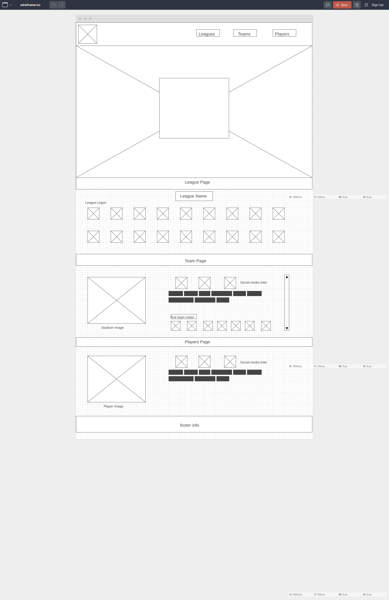

# Club Football Central

### The beautiful game?!?


# Project Overview


## Project Description

This project is an app for any fan of club football (aka soccer).  It's not just for the supporters of Manchester United, Barcelona, PSG, and Juventus but even for fans of Ipswich Town FC or Boavista FC.  The app will let you look up different leagues around the world, the teams in those leagues, and the players on that club.

## Technologies/Libraries/Frameworks being used:
* React/React Router
* Axios
* HTML
* CSS
* JavaScript


## API to be used:
The [Sports DB API] (https://www.thesportsdb.com/api.php) is a freemium API that allows developers to consume sports league data in JSON format easily. The free API gives you all features except for videos and live scoring. It also limits your result set to 250.

## Wireframes
[https://wireframe.cc/Rlq1Lt](https://wireframe.cc/Rlq1Lt)



## MVP/PostMVP

###MVP
* axios call to Sports DB API
* display information about different leagues
* allow users to select a league
* If a user selects a league pull up information about the league (country, current table, description, etc.) and provide links to individual teams in the league
* If a user selects a club, pull up information about the club (country, league,city, stadium, team crest, etc.) and provide links to player cards
* If a user selects a player, pull up information about the player


###PostMVP
* Add social links on page.
* Add videos content.  Sports DB API only provides videos for paid subscribers, so hit a second API and pull back relevant videos based on the page they are on.
* Add Search functionality so users can go directly to a league, team or player page

## React Component Hierarchy
```
<App />
    <Header />
    <Main />     //main page
    <League />   //page with selected league
      <Social>   //section with social media links
    <Club />     //page with selected club
      <Social>   //section with social media links
    <Player />   //page with selected player 
      <Social>   //section with social media links
    <Footer />
```

## Helper Functions
 Function | Description | 
| --- | :---: |  
| formatDate(date) | This will take a date and return it in a yyyy-mm-dd format |
|tomorrowsDate()|Returns a Date data type with tomorrow's date|
|saturdayDate()| Returns Saturdays date based on the current system date|
|sundayDate()| Returns Saturdays date based on the current system date|


## Issues and Resolutions

**ISSUE**: 2 prominent leagues (La Liga and MLS) wasn't returned in API call for all leagues due to free API limit of 50 records.
**RESOLUTION**: In the api heler function, I made 2 additional API calls to get those 2 leagues and then append the results of all the API calls into one array and they sort them by league name.

**ISSUE**: On some pages with a lot of content, the page would load in the middle of the page, not at the top.
**RESOLUTION**: Thanks to Brian and Shay, who suggested to add the following code before the return statment in the component.
```
 window.scrollTo(0, 0)
 ```
 before the return statment in the component.
